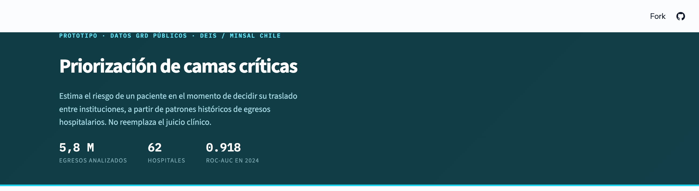
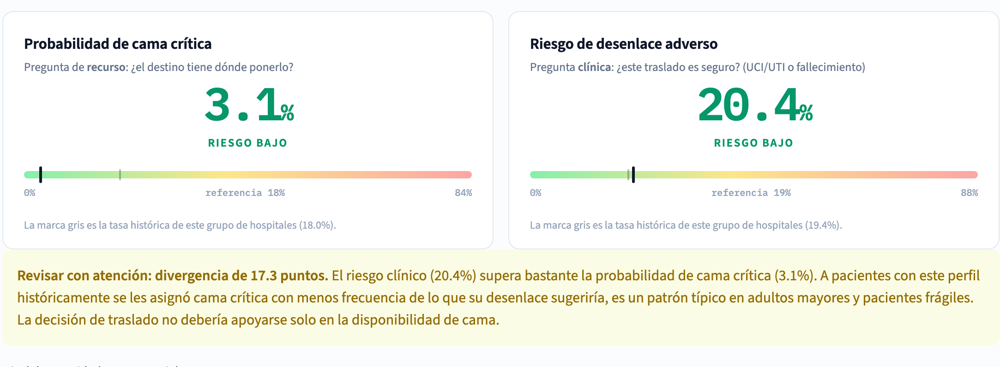

# Predictor de riesgo de cama crítica (UCI/UTI) con datos GRD de Chile

**▶️ [Probar la aplicación](https://riesgo-uci-traslados-chile.streamlit.app)**  ·  **[Ver un caso de ejemplo ya calculado](https://riesgo-uci-traslados-chile.streamlit.app/?demo=1)**



Modelo y aplicación para estimar, **al momento de decidir el traslado de un paciente
entre instituciones**, dos cosas distintas:

- **Probabilidad de cama crítica**, pregunta de recurso: ¿el hospital de destino tiene dónde ponerlo?
- **Riesgo de desenlace adverso**, pregunta clínica: ¿este traslado es seguro?

Construido sobre los egresos hospitalarios públicos GRD de Chile (DEIS/MINSAL, 2019-2024):
**5,8 millones de admisiones, 62 hospitales** con unidad crítica propia.

---

## El hallazgo principal: mi primer modelo daba 0,955 y era mentira

La primera versión alcanzó **ROC-AUC 0,955**. Al auditarla encontré que tres variables
filtraban información del futuro. La versión honesta rinde **0,918**.

| paso | ROC-AUC |
|---|---|
| versión inicial | 0,955 |
| quitar variables contaminadas | 0,931 |
| quitar población ambulatoria | 0,913 |
| corregir bugs (edad, comorbilidad) | 0,913 (±0,000) |
| excluir 2019 (subregistro) | 0,915 |
| subcódigo CIE-10 + 19 comorbilidades | **0,918** |

### Por qué las tres variables eran fuga

El GRD es una base de **egresos**: la ficha se llena al alta. Una columna solo sirve como
predictor si su *valor* se conocía cuando hay que decidir, no solo si existe en el archivo.

| variable | por qué se descartó |
|---|---|
| `especialidad_medica` | Es el servicio tratante consolidado al alta. `MEDICINA INTENSIVA ADULTO` → **98 % de tasa de UCI**: casi un sinónimo de la respuesta. |
| `n_diagnosticos_secundarios` | Cuenta casillas llenadas durante toda la estadía. Con 0 diagnósticos la tasa es 3,1 %; con 15 o más, **54 %**. Un paciente sale con 12 diagnósticos porque se complicó, no porque llegara así. |
| `n_procedimientos` | Igual, y además arrastraba procedimientos de soporte vital hechos *dentro* de la UCI. |

Es la diferencia entre predecir quién gana un partido y contar los goles del partido.

---

## El segundo hallazgo: la etiqueta medía racionamiento, no gravedad

Al validar el modelo apareció algo contraintuitivo: **el riesgo bajaba con la edad**.
Contrastando el uso de UCI contra la mortalidad quedó claro por qué.

**Neumonía (J18):**

| edad | uso de UCI/UTI | mortalidad |
|---|---|---|
| menores de 50 | 22,3 % | 3,9 % |
| 65 a 79 | 19,2 % | 17,6 % |
| **80 o más** | **8,6 %** | **23,3 %** |

Los mayores de 80 usan **2,6 veces menos UCI** y mueren **6 veces más**. Mismo patrón en
sepsis (55 % → 26 % de uso mientras la mortalidad sube de 18 % a 50 %).

No es que estén menos graves: es limitación del esfuerzo terapéutico y racionamiento de
camas. Un modelo entrenado solo sobre "¿ocupó cama crítica?" diría **riesgo bajo** justo
para los pacientes más frágiles.

La aplicación muestra los dos puntajes y avisa cuando divergen. Este es un paciente de
88 años con neumonía, trasladado desde otro hospital, con hipertensión, diabetes,
enfermedad renal crónica, insuficiencia cardíaca y demencia:



**La solución fue entrenar un segundo modelo** sobre `UCI/UTI o fallecimiento`, que no
sufre ese sesgo del mismo modo. Cuando ambos puntajes divergen, esa divergencia es la
señal más útil: riesgo clínico alto con probabilidad de cama baja marca exactamente los
casos que un comité debe revisar dos veces.

| edad (neumonía, trasladado) | cama crítica | riesgo clínico | divergencia |
|---|---|---|---|
| 40 | 7,3 % | 11,6 % | +4,3 pp |
| 70 | 4,8 % | 11,6 % | +6,8 pp |
| 90 | **3,4 %** | **13,6 %** | **+10,3 pp** |

---

## Resultados

| modelo | ROC-AUC | Average Precision | tasa base |
|---|---|---|---|
| Probabilidad de cama crítica | 0,918 | 0,745 | 18,0 % |
| Riesgo de desenlace adverso | 0,915 | 0,748 | 19,4 % |

Restringido a la población objetivo (102.476 pacientes trasladados desde otra institución):
**AUC 0,908 · AP 0,818**.

Entrenamiento 2020-2023 (2,93 M admisiones), evaluación en **2024**, un año completo no
visto durante el entrenamiento, en vez de un split aleatorio.

---

## Decisiones metodológicas

Todas verificadas midiendo, no asumiendo:

- **Hospitales sin unidad crítica propia excluidos.** Derivan a sus pacientes, así que el
  traslado no queda en sus registros y la etiqueta quedaría contaminada.
- **Índice de Charlson eliminado.** Estaba mal implementado (85 de 177 prefijos escritos sin
  punto, cuando los códigos vienen como `E11.5`), pero al arreglarlo aportaba **+0,001** de
  AP sobre la clasificación CC/MCC del IR-GRD chileno. Se eliminó en vez de arreglarse.
- **Población acotada a hospitalizaciones reales.** Fuera la cirugía mayor ambulatoria
  (1,2 % de tasa de UCI) y las sesiones de quimioterapia y diálisis. El corte es por
  *diagnóstico*, no por procedimiento: el procedimiento de hemodiálisis tiene 19,4 % de tasa
  de UCI porque también se dializa a críticos con falla renal aguda.
- **2019 excluido.** Subregistraba la etiqueta (9,1 % vs ~14 %). Entrenar sin ese año mejora
  el resultado pese a usar un millón de filas menos.
- **Diagnóstico en dos niveles.** La categoría de 3 caracteres (`I21`) agrupa cuadros muy
  distintos: `I21.0` (infarto de pared anterior) tiene 76,9 % de tasa de UCI y `I21.4` (sin
  elevación del ST) un 52,9 %. Pero usar solo el código completo empeora, porque hay 8.947
  distintos y el top-200 cubriría apenas el 58 % de los casos frente al 80 % de la categoría.
  Se usan **los dos a la vez**: cobertura amplia y detalle donde hay volumen.
- **19 banderas de comorbilidad** derivadas de los diagnósticos secundarios, agrupadas por
  sistema (cardiovascular, metabólico y renal, respiratorio, oncológico e inmune).
- **Edad corregida a años cumplidos.** `date_diff('year', ...)` en DuckDB cuenta cruces de
  1 de enero: un recién nacido del 31 de diciembre ingresado el 1 de enero figuraba con
  1 año. Afectaba a 49.081 casos, en el tramo etario con 47 % de tasa de UCI.

---

## Estructura

```
src/extract_data.py    Pipeline DuckDB: lee los .txt GRD crudos y construye el parquet
src/train_model.py     Entrena ambos modelos, split temporal, guarda métricas y curvas
src/app.py             Aplicación Streamlit
referencias/           Tablas maestras MINSAL, norma nacional GRD, diccionario CIE-10
models/                Modelos entrenados + metadatos
```

## Reproducir

```bash
pip install -r requirements.txt
streamlit run src/app.py          # usa el modelo ya entrenado
```

Para regenerar todo desde cero hacen falta los `.txt` del
[portal de datos abiertos del DEIS](https://deis.minsal.cl/), unos 4 GB:

```bash
export GRD_DIR="/ruta/a/bases de datos GRD"
python src/extract_data.py        # ~1 min, construye data/admisiones.parquet
python src/train_model.py         # ~5 min, entrena los dos modelos
```

## Limitaciones

- **No es un dispositivo médico.** Es un prototipo de apoyo a la gestión basado en patrones
  históricos de codificación administrativa, no un score clínico validado como NEWS2 o APACHE.
- **No incluye signos vitales ni laboratorio.** Los datos GRD son administrativos: no tienen
  presión arterial, saturación, lactato ni escalas de gravedad al ingreso.
- **La mortalidad intrahospitalaria tampoco es un patrón oro puro.** La limitación del
  esfuerzo terapéutico influye en morir, no solo en recibir una cama. El segundo modelo
  reduce mucho el sesgo de racionamiento, no lo elimina.
- **El diagnóstico puede no estar consolidado** en el momento exacto de la decisión: depende
  de si la codificación en tiempo real ya registró el diagnóstico secundario relevante.

---

Datos: [DEIS / MINSAL Chile](https://deis.minsal.cl/). Egresos hospitalarios GRD, de uso público.
